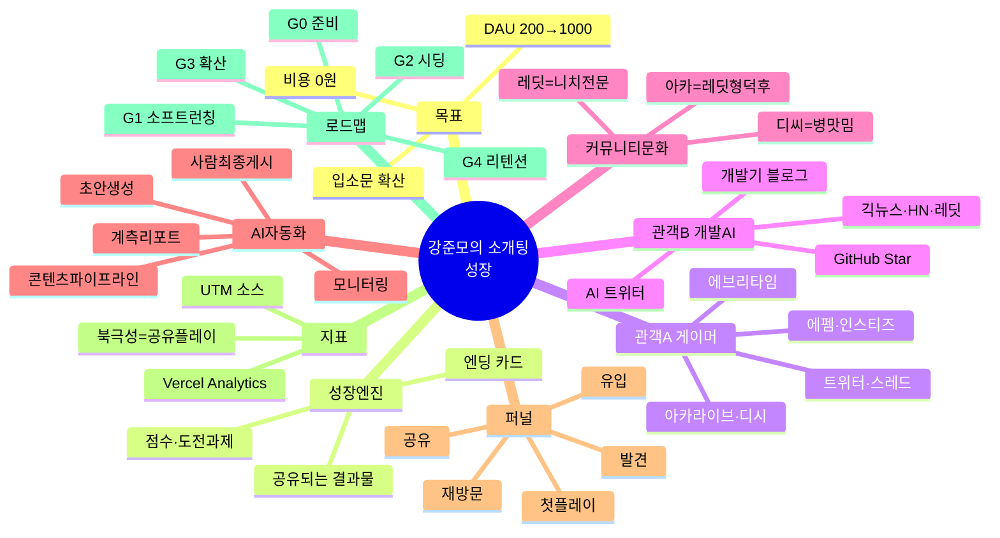

# 📈 성장·배포 아키텍처 — 강준모의 소개팅

> "아무리 잘 만들어도 안 보이면 없는 것." 게임 개발과 **동급의 프로젝트**로 다루는 성장 전략.
> 개발 로드맵은 [`ROADMAP.md`](ROADMAP.md), 이 문서는 **"어떻게 많은 사람이 보게 하는가"**.

---

## 🏛️ 두 개의 기둥

> **이 프로젝트는 기둥이 둘이다 — ① 게임(만든다) · ② 성장(보이게 한다). 둘은 동급.**
> 성장도 게임처럼 **설계 → 실행 → 계측 → 개선** 루프로 굴린다. 이 문서가 그 설계도.

```
        강준모의 소개팅
        ┌──────────┬──────────┐
      게임 기둥              성장 기둥
   (ROADMAP.md)            (이 문서)
   무엇을 만드는가          어떻게 보이게 하는가
        └──────────┴──────────┘
              같은 무게
```

## 🎯 목표 & 원칙

- **목표**: 지인 데모 → 커뮤니티 확산 → **DAU 200 → 1000**. 비용 0원 유지.
- **원칙**
  1. **공유되는 게 곧 성장** — 자랑/캡처하고 싶은 결과물을 만든다(엔진).
  2. **광고비 0** — 입소문·커뮤니티·검색만으로.
  3. **두 관객을 동시에** — ① 게이머/일반(게임 재미) ② 개발자·AI(만든 방식이 화제).
  4. **홍보 아님, 공유 유발** — 도배는 역효과. "볼 만한 걸 놓아두고 사람들이 옮기게".
  5. **AI 에이전트로 반자동화 지향** — 게임을 AI(Claude Code)로 만들었듯, 홍보도 AI 에이전트가 **보조**(모니터링·초안·계측). 단 커뮤니티 직접 자동포스팅은 **금지**(사람이 최종 게시). → 아래 [자동화 레이어](#-ai-에이전트-자동화-레이어-오픈클로-연결).

---

## 🏛️ 성장 아키텍처 = 퍼널 × 성장 루프

### 1) 획득 퍼널 (Acquisition Funnel)
```
발견(Reach)   →  유입(Click)  →  첫 플레이(Activation)  →  공유(Referral)  →  재방문(Retention)
커뮤니티 글       썸네일·한 줄       3분 안에 "오 재밌다"       엔딩 캡처·링크       새 파트너·업데이트
GitHub/검색       OG 이미지         모바일 3초 로딩            "내 점수 자랑"       도전과제 수집
```
각 단계의 **이탈 원인 = 성장 병목**. 지금 최우선 병목: **발견(아무도 모름)** → **공유 장치 부재**.

### 2) 성장 루프 (Growth Loop) — 진짜 엔진
```
        ┌─────────────────────────────────────────┐
        │  플레이 → 재밌는/웃긴 엔딩·점수 획득        │
        │     ↑                          ↓         │
        │  새 유저 ← 커뮤니티/SNS에 캡처·링크 공유    │
        └─────────────────────────────────────────┘
```
> 이 루프가 돌면 **광고 없이 스스로 퍼진다.** 그래서 "공유 유발 콘텐츠"(아래)가 핵심.

---

## 👥 두 관객 × 채널 전략

### A. 게이머 / 일반 (게임 재미가 훅)
| 채널 | 톤 / 방법 | 훅 |
|---|---|---|
| **아카라이브·디시(관련 채널)** | 자연스러운 "이런 거 만들어봄" 글 | 스샷 + 플레이 링크 |
| **에펨코리아·인스티즈** | 유머/후기 톤, 공감 | "AI랑 소개팅 하는데 차임 ㅋㅋ" 밈 |
| **에브리타임(대학)** | 심심풀이·자유게시판 | 3분 킬링타임 |
| **트위터/X · 스레드** | 짧은 클립·엔딩 캡처 | 도전과제·"내 결과" 자랑 |
| **레딧** r/koreanvariety, r/visualnovels | 영어 소개 | 무료 웹 플레이 |

### B. 개발자 / AI 커뮤니티 (**만든 방식**이 훅 — 지금 가장 강력)
> "1인이 **Claude Code로 바이브 코딩**해 만든 한국어 AI 소개팅 게임" = 그 자체로 이야깃거리.

| 채널 | 훅 |
|---|---|
| **GitHub** (README·⭐) | 쇼케이스 README + 설계 볼트(design-vault) = "설계까지 한 진짜 프로젝트" |
| **GeekNews(긱뉴스)·클리앙/개발** | "AI로 게임 만든 회고" |
| **Hacker News · r/programming · r/SideProject** | "I built an AI dating sim with Claude Code" |
| **AI 트위터 / 스레드** | 개발 과정 스레드(설계→검수→배포) |
| **velog·브런치·티스토리** | 개발기 블로그 → 검색 유입 자산 |

---

## 🏘️ 커뮤니티 문화 플레이북 (저격 가이드)

> **커뮤니티마다 언어가 다르다. 톤 틀리면 즉시 씹힌다.** 시딩 전 반드시 해당 채널 규칙·최근 글 톤 확인.

### 아카라이브 (arca.live) — **1차 시딩 (저위험·덕후 인정)**
- **정체성**: 채널(=서브레딧) 기반. 오타쿠·서브컬처·게임·**AI**·창작 밀도 높음. 루리웹/디씨 이탈자 유입.
- **분위기**: **레딧에 제일 가까움.** 자작물 우호적(잘 만들면 인정), 정보성·기술 콘텐츠 선호. AI 채널(그림·LLM·프롬프트) 매우 활발.
- **저격**: "자작 소개" 톤 + "어떻게 만들었나"(기술 훅) 곁들이기. 스샷 + 플레이 링크. 채널 후보 = 미연시/비주얼노벨·인디게임·AI 관련.
- **지뢰**: 대놓고 광고, 채널 규칙 무시, 저품질, 자작 인증 없이 뻔뻔.
- **덕후 전문가?** → **O (레딧형).** "변태밖에" = X. 단 성인 채널 존재 → **채널 선택이 전부.**

### 디시인사이드 (dcinside) — **2차 (고위험·고수익 밈)**
- **정체성**: 한국 밈 발원지. 갤러리 기반. 익명·날것·빠름.
- **분위기**: **병맛·유머·냉소가 기본 언어.** 진지·홍보 톤 = 즉시 조리돌림. 재밌으면 폭발, 아니면 소멸.
- **저격**: "AI랑 소개팅했는데 차임 ㅋㅋ" 식 **자학·밈·드립.** 홍보 티 = 죽음. 갤 후보 = 미연시갤·인디게임갤·프로그래밍갤.
- **지뢰**: 홍보 알레르기 극심, 유머 없는 진지함, 어그로 없는 밋밋함.
- **덕후 vs 변태?** → **갤마다 극과 극.** 전문 갤엔 진짜 덕후·개발자 / 전반 톤은 날것·병맛. **갤 선택이 90%.**

### 레딧 (해외) — 개발/화제성 확장
- r/SideProject·r/webgames·r/visualnovels·r/programming. 아카라이브와 결 비슷(니치 전문). "I built ~ with Claude Code" 톤.

### 한눈에
| | 아카라이브 | 디씨 | 레딧 |
|---|---|---|---|
| 결 | 레딧형 덕후·전문 | 병맛·밈·카오스 | 니치 전문(영어) |
| 자작/홍보 관용 | 우호적(자작 인증 시) | 극혐(유머면 예외) | 우호적(저품질 X) |
| 리스크 | 낮음 | 높음 | 낮음 |
| 터졌을 때 도달 | 중 | **대(밈 바이럴)** | 중~대 |
| 우리 순서 | **1차** | 2차 | 병행(개발 훅) |

> **전략**: 아카라이브에서 자작 톤으로 다듬고 → 반응 좋은 훅을 디씨 밈 톤으로 변주해 확산 → GitHub/개발기가 화제성·포트폴리오 본진.

---

## 🪝 공유 유발 콘텐츠 (루프의 연료 — 없으면 안 퍼짐)

- **엔딩 결과 카드** 🔴최우선 — 엔딩을 예쁜 이미지 카드로 자동 생성 → 캡처·공유 (ROADMAP v1.2)
- **"내 소개팅 점수/스타일"** — 결과에 라벨(예: "직진형 낭만파") → MBTI식 자랑 심리
- **도전과제·히든엔딩 수집** — "이거 봤어?" 유발 (이미 구현됨)
- **밈 소재** — 준모의 굳은 표정, 차이는 순간 캡처 = 짤 확산
- **OG 이미지 / 미리보기** — 링크 붙였을 때 뜨는 썸네일 (SEO, v1.0)

---

## 📊 지표 (측정 없으면 개선 없음)

| 단계 | 지표 | 도구 |
|---|---|---|
| 발견 | 유입 소스별 방문 | Vercel Analytics (UTM 링크) |
| 활성화 | 방문→첫 선택 전환율, 이탈 턴 | Analytics 이벤트 |
| 공유 | 공유 클릭·유입 재유입 | 공유 링크 UTM |
| 리텐션 | 재방문율(D1/D7), 도전과제 달성 | Analytics + localStorage |
| GitHub | ⭐ Star, 방문 | GitHub Insights |

> **북극성 지표(North Star): 주간 "공유 발생 플레이 수"** — 루프가 도는지 보여줌.

---

## 🧱 콘텐츠 자산 시스템 (foundation — 반복 생산의 틀)

> 홍보를 매번 즉흥으로 X → **재사용 자산 + 템플릿**으로 시스템화. 이게 자동화(아래)의 재료가 됨.

- **자산 라이브러리**: 스샷 세트(엔딩·표정·선택지), 캐릭터 소개 카드, 로고·OG, 짧은 GIF/클립.
- **게시글 템플릿**: 아카(자작 톤) / 디씨(밈·자학) / 레딧(EN) / 개발기(회고 블로그) — 4종 골격.
- **훅 뱅크**: 재사용 훅 문장 모음 — "AI가 나한테 차였다", "1인이 Claude Code로 만든 소개팅", "내 소개팅 점수 자랑" 등.
- **캐던스**: 도배 금지. **채널당 "가치 글 1편 → 반응 관찰 → 후속 1편"**, 주 1~2회 페이스.

## 🤖 AI 에이전트 자동화 레이어 (오픈클로 연결)

> 게임을 AI로 만들었듯 **홍보도 AI 에이전트가 보조**. 핵심 = **Human-in-the-loop(사람이 최종 게시)**.
> ⚠️ **커뮤니티 직접 자동포스팅 금지** — 스팸·차단·ToS 위반. 에이전트는 "보조·분석·초안"까지만.

**에이전트 역할 6**
1. **모니터링** — 언급·검색·반응 수집, 브랜드/키워드 트래킹.
2. **초안 생성** — 채널 톤 맞춘 게시글·댓글 초안(아카/디씨/레딧별).
3. **콘텐츠 파이프라인** — 스샷 → 결과 카드 → OG 이미지 자동 생성.
4. **계측·리포트** — 유입 소스·전환·북극성 지표 주간 요약.
5. **스케줄 제안** — 언제/어디 올릴지 추천(게시는 사람).
6. **피드백 루프** — 반응 데이터로 다음 훅·채널 우선순위 조정.

- **메타 스토리**: *"AI로 만든 게임을 AI로 홍보한다"* = 그 자체가 화제성 훅(포트폴리오에 강력).
- **도입 시점**: G0~G1 수동 검증 → **G2부터 에이전트 보조 점진 도입** → G3 계측 자동화.
- **스택(예)**: Claude / Claude Code 에이전트 + Vercel Analytics + 이미지 생성 파이프라인.
- **가드레일**: 커뮤니티 규칙 준수 · 사람 최종 승인 · 도배/스팸 절대 금지 · 톤·신원 일관성.

---

## 🗺️ 성장 로드맵 (개발 로드맵과 병행)

```
G0 준비        G1 소프트런칭    G2 커뮤니티 시딩   G3 확산          G4 리텐션·플랫폼
[지금]          [지인+깃허브]     [DAU 50]          [DAU 200~500]    [DAU 1000+]
```

- **G0 · 준비 (지금)**
  - ✅ 쇼케이스 README / ✅ 게임 완성도(3인 대사·버그·UI)
  - 🔲 OG 이미지 + 메타태그, 🔲 UTM 링크 체계, 🔲 Vercel Analytics 확인
  - 🔲 **엔딩 공유 카드**(루프 엔진) — G2 전 필수
- **G1 · 소프트런칭 (지인 + GitHub)**
  - 지인 20~50명 플레이 → 피드백·버그·재미 검증
  - GitHub 공개 + "만든 이야기" 글 1편(velog/스레드)
- **G2 · 커뮤니티 시딩 (DAU 50 목표)**
  - **아카라이브 1차**(자작 톤) → 반응 본 뒤 **디씨 2차**(밈 톤). 관객 B(개발) 병행. 도배 X
  - 반응 좋은 채널에 집중, UTM으로 어디서 오는지 측정
  - 🤖 **AI 에이전트 보조 도입 시작** — 모니터링·채널별 초안·주간 지표 리포트(게시는 사람)
- **G3 · 확산 (DAU 200~500)**
  - 잘 먹힌 훅 반복 + 인플루언서/유튜버 플레이 유도
  - v1.1 콘텐츠 업데이트로 "돌아올 이유" 제공
  - 🤖 **계측 자동화 + 콘텐츠 파이프라인**(스샷→카드→OG) 에이전트화
- **G4 · 리텐션·플랫폼 (DAU 1000+)**
  - 소셜 공유 기능 고도화, 유저 제작 시나리오(v2.0), 재방문 루프

> DAU 구간·인프라 비용은 [`ROADMAP.md`](ROADMAP.md) 지표표와 연동.

---

## 🧠 마인드맵



---

## ⚠️ 커뮤니티 에티켓 & 리스크

- **자기홍보 규칙 확인** — 각 커뮤니티 규정(홍보 금지판, 도배 제재). 위반 시 역효과+차단.
- **도배 금지** — 한 채널에 반복 X. "가치 있는 글 1편" > "홍보 글 10편".
- **진정성** — "제가 만들어봤어요" 톤. 광고처럼 보이면 바로 거부감.
- **AI 노출 여부** — "AI가 만든/AI로 하는" 훅은 화제성 크지만, 커뮤니티에 따라 반감도 있음 → 관객별로 톤 조절.
- **비용 폭주 방어** — 확산 성공 시 Groq 호출 급증 → 일일 제한/유료 한도(ROADMAP v0.3) 먼저 대비.

---

## ✅ 확정 방향 (2026-07-02)

- **1순위 목표 = 화제성·포트폴리오** → 전략 무게중심을 **GitHub ⭐ · 개발기 · "만든 이야기"** 에. 관객 B(개발·AI) 비중을 높이되, 시딩은 아래 커뮤니티부터.
- **시딩 시작 채널 = 게임·오타쿠(아카라이브·디씨)** → 이 커뮤니티 안에서 **게임 재미 훅 + "AI로 만든" 훅 병행**(아카라이브는 창작/게임/AI 채널이 공존).
- 🔲 **미정 — AI 훅 전면화 여부**: 목표가 화제성이라 *AI 스토리가 강력*. **기본값 = "내세우되 채널별 조절"** 추천(개발/AI 채널엔 전면, 순수 게임 채널엔 재미 먼저).
- 🔲 **미정 — 공개 톤(익명 vs 실명 포트폴리오)**: 포트폴리오 목표면 실명 연결이 자산이나, 커뮤니티 시딩은 익명이 편함 → **하이브리드**(커뮤니티=익명 시딩 / GitHub·개발기=포트폴리오) 추천.

### 🚀 다음 실행(G0) — 화제성·포트폴리오 트랙
1. **GitHub 저장소 메타 정비** — description·topics(태그)·OG 이미지 → ⭐ 받기 좋은 첫인상.
2. **"만든 이야기" 시드 글 초안** — 아카라이브 적합 채널용(스샷 + 플레이 링크 + "AI로 만든" 훅). 화제성의 핵심 자산.
3. **엔딩 공유 카드**(성장 루프 엔진) — 게임 재개 시 최우선 개발 항목으로.

> 위 미정 2개(AI 훅·공개 톤)는 시드 글 쓰면서 톤으로 자연스럽게 확정.

---

*최초 작성: 2026-07-01 · 성장을 게임 개발과 동급 프로젝트로 관리 시작*
